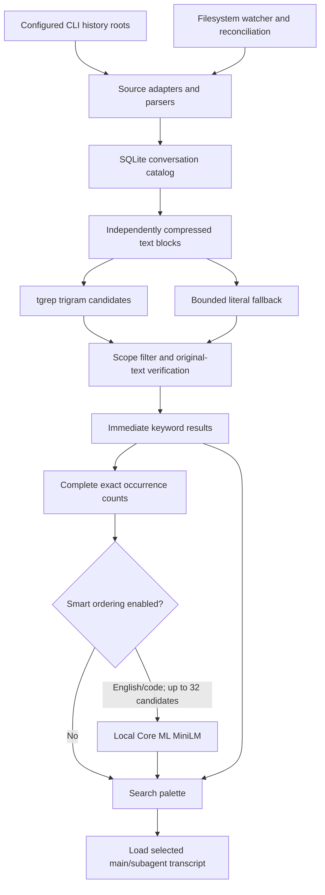

# Architecture

CC Buddy 2.x is a native macOS application in `native/`, built with SwiftUI and AppKit.
It ships as a universal arm64/x86_64 app for macOS 13 and later. `src-tauri/`,
`src/renderer/` and parts of `src/shared/` remain in the repository for the legacy
application, shared assets/localization, compatibility tests and release tooling.
The native application does not use a web renderer or a Tauri IPC layer.

## Application ownership

`CCBuddyApp` declares the window and scene commands. `AppDelegate` manages application
lifecycle, the menu-bar panel, window handoff and single-instance behavior. Hosted unit
tests deliberately create an empty application root so XCTest does not instantiate the
production model or touch live history and configuration.

`AppModel` is the main-actor owner of configuration, navigation, provider selection and
service lifecycle. It preserves the existing `~/.ccbud/config.json` schema through
`ConfigRepository`. `ConversationStore`, `SkillsStore` and `MonitorStore` own the state
for their respective workspaces. Blocking parsing and search work runs in background
workers; published state returns to the main actor. Request generations and cancellation
guards prevent older completions from replacing a newer query, scope or selection.

Gateway/plugin startup, usage refresh and update initialization have their own tasks.
The semantic model loads only when an enabled semantic search needs it; constructing
the shell does not download or initialize a model.

## History and search data flow

History discovery resolves only configured/enabled roots. Source-specific parsers normalize
Claude Code, Codex, Qoder, Grok Build, Copilot and Antigravity records into common metadata,
messages, totals and subagent relationships. The catalog coordinator owns reconciliation
and watching. SQLite is the durable derived catalog; producer histories remain the source
of transcript truth. Selecting a row loads its main/subagent content without requiring all
transcripts to be resident in memory.

`IndexedHistoryRepository` applies scope, source, deletion and catalog limits. Search keeps
stable file/transcript identities, original snippets, occurrence counts and message positions
so opening a result can navigate to the correct transcript location. Archive mutations,
imports, raw/HTML exports and CLI resumption are separate services; search does not rewrite
producer history.

### tgrep is a candidate accelerator

`History/TgrepSearchIndex.swift` exposes a small C ABI implemented by
`native/TgrepBridge`. Cargo pins `microsoft/tgrep` to an immutable revision and checks in
the dependency lockfile. The app loads only its signed
`Contents/Frameworks/libccbuddy_tgrep.dylib`; it does not launch a shell, search `PATH`,
or depend on a developer's checkout.

The Swift catalog stores logical transcript identities separately from approximately
32 KiB, independently LZFSE-compressed UTF-8 blocks. It supplies case-folded, canonically
normalized blocks with boundary lookahead and numeric SQLite chunk IDs. Rust combines a
bounded live overlay with memory-mapped trigram postings. A sibling `.tgrep-chunks-v1`
directory with mode `0700` holds immutable persistent
checkpoints; its manifest stores numeric IDs and hashed identities, not transcript text
or paths. It does not walk history roots or keep another copy of complete transcripts.
The first eligible query restores a valid checkpoint or builds the derived index, and
later queries synchronize changed/deleted blocks by catalog and storage revision. Reopen checks
file integrity, normalization version and SQLite identities before trusting a checkpoint.
Temporary working overlays are removed on normal close; committed checkpoints survive
app restarts. A concurrent publisher uses a separate private overlay. Validated lifetime
leases allow abandoned new-format workspaces to be reclaimed without deleting active
workspaces. Legacy unmarked caches are conservatively retained.

Queries whose normalized UTF-8 form contains at least three **bytes** can use tgrep,
including one- and two-character Han terms. A SQLite read transaction binds index
synchronization and candidate IDs to a consistent catalog snapshot. Swift then verifies
the candidates against decoded text blocks and applies visibility filters. Short queries and
unavailable/incompatible acceleration use the same exact matcher over sequential bounded
blocks. There is no SQLite FTS creation, update or query fallback. Legacy body conversion,
FTS retirement and space reclamation happen in resumable background maintenance. Engine failures
do not turn a partially built index into authoritative empty results. The palette reports
the engine, indexed-document/candidate counts and measured query duration.

Exact verification first publishes a usable match with a marked count lower bound, then
counts complete, nonoverlapping occurrences without delaying opening the result. Match
starts belong to one block; query-sized lookahead preserves cross-block matches. Original
snippets and UTF-16 message anchors remain stable while counts finish. Revision changes
restart the result prefix instead of mixing snapshots. Folded Codex child-rollout hits keep the visible
parent row and the child transcript key for navigation. [Search performance](search-performance.md)
separates cold import, checkpoint restoration, candidate generation, exact matching and
production repository timings, including their limitations.

### Core ML is optional ordering

`Services/LocalSemanticSearch.swift` is an actor conforming to the injectable
`SemanticSearchRanking` protocol. It accepts only candidates already authorized by the
store and cannot discover or add a conversation. Keyword results appear before model
preparation or prediction. Smart ordering considers at most 32 leading results; disabling
it restores keyword order, and errors preserve keyword results.

The bundled Apache-2.0 MiniLM model produces 384-dimensional vectors from a 128-token
WordPiece input. It uses masked mean pooling, cosine similarity, float16 computation and
int8 stored weights. English and code queries are its intended use. A conservative
non-Latin-letter check declines reranking for queries such as Chinese, Japanese and
Korean; this is a script check, not a claim of multilingual quality or language detection.

Linear projections are converted to equivalent 1×1 convolutions with four-dimensional
attention to make transformer operations suitable for ANE scheduling. Apple Silicon uses
`.cpuAndNeuralEngine`; Intel uses `.cpuOnly`. If loading with ANE enabled fails, the service
retries on CPU. Other failures return the original order with an unavailable diagnostic.

Core ML decides placement. On macOS 14.4+, the service inspects `MLComputePlan` and reports
how many operations prefer Neural Engine. This is anticipated placement, not per-prediction
hardware utilization. On earlier OS versions or an unavailable plan, placement remains
unknown. A shared preparation task avoids duplicate cold loads; an in-memory LRU holds up
to 512 normalized vectors keyed by the complete input text's SHA-256. Inference checks
cancellation between predictions. No query, transcript or vector is sent over the network
by this service, and vectors are not persisted in the conversation catalog.

[The model guide](../native/SEMANTIC_SEARCH.md) contains pinned provenance, conversion
parity, benchmark conditions, cold-start cost and reproduction commands. These boundaries
also distinguish local semantic inference from user-initiated gateway requests, which do
go to the selected upstream provider.

## Main modules

| Native path | Responsibility |
| --- | --- |
| `Sources/App` | App/scene commands, window configuration, lifecycle and single instance |
| `Sources/Design`, `Sources/Views` | Design tokens, native surfaces, workspace views and accessible interactions |
| `Sources/History` | Source discovery/parsers, catalog, watching, indexing and exact search |
| `Sources/Services/Conversation*` | Conversation state, archive/mutations, HTML export, replay and CLI resume |
| `Sources/Services/LocalSemanticSearch.swift` | Bounded offline Core ML semantic ordering and diagnostics |
| `TgrepBridge`, `Sources/History/TgrepSearchIndex.swift` | Pinned Rust trigram engine and Swift ABI wrapper |
| `Sources/Gateway` | Bifrost configuration, management credentials and supervised process lifecycle |
| `Sources/Services/CLIConnectionManager.swift` | Claude/Codex configuration, backups and recovery |
| `Sources/Plugins` | Plugin manifests, installation, Git updates, processes and control plane |
| `Sources/Skills` | Skills discovery, library/index, import, installation and tool synchronization |
| `Sources/Usage`, `Sources/MenuBar` | Usage scanning/cache, filesystem refresh and menu-bar presentation |
| `Sources/Services/Monitor*`, `Sources/Services/BifrostManagementClient.swift` | Request/log state and gateway inspection |
| `Sources/Services/Update*` | Release metadata, verification, staged installation and relaunch |
| `Sources/Localization`, `Resources/*.lproj` | Native language selection and translated strings |

The local Bifrost gateway listens on loopback and handles Anthropic Messages, OpenAI Chat
Completions and OpenAI Responses. It owns model-API traffic and protocol conversion;
the Rust tgrep library handles no gateway traffic. Monitor payloads are kept in Bifrost's
app-private SQLite logs with the configured retention policy. See
[gateway log privacy](../native/README.md#gateway-log-privacy) for its cleanup timing.

## Interface and compatibility

The shell provides a floating navigation rail, conversation list, transcript reader and
optional inspector/focus layout. A global ⌘K search palette supports arrow-key navigation,
Return and Escape; scene commands also expose workspace switching, focus reading, refresh
and Settings. Accessibility identifiers remain part of the UI test contract.

| Capability | Availability and fallback |
| --- | --- |
| Native app, tgrep and CPU semantic model | macOS 13+, arm64 and x86_64 universal releases |
| CPU + Neural Engine policy | Apple Silicon; model-load CPU fallback |
| Per-operation compute-plan diagnostics | macOS 14.4+; unknown when unavailable |
| Native SwiftUI glass | macOS 26+; material or opaque surfaces on earlier systems |
| Motion, transparency and contrast | Respect Reduce Motion, Reduce Transparency and Increase Contrast |

The redesign follows a macOS 27 direction using available macOS 26 APIs protected by
availability checks. It does not raise the deployment target or assert testing on macOS 27.

## Build and verification

`native/project.yml` is the XcodeGen source of truth. Builds prepare a pinned Bifrost
helper, compile the Rust dylib, verify model checksums and let Xcode compile the bundled
Core ML package. Universal releases include both helper architectures as well as both
application slices. No model fetch or Python dependency installation happens at app runtime.
Follow [the native build/test guide](../native/README.md) for the exact commands.

| Layer | Checks |
| --- | --- |
| Native unit/integration | Parsers, index parity and scope isolation, mutations/exports, gateway/CLI loopback E2Es, plugins, Skills, updates, UI state, real Core ML model and tokenizer |
| Native UI | Actual application workflows, keyboard search/focus/navigation, semantic controls, accessibility identifiers and visual presentation |
| Rust bridge | `cargo test --locked --manifest-path native/TgrepBridge/Cargo.toml` |
| Model provenance | `python3 native/Scripts/verify-semantic-model.py`; conversion additionally checks float32/quantized numerical parity |
| Shared/legacy compatibility | `npm test` and `cargo test --locked --lib --manifest-path src-tauri/Cargo.toml` |
| Packaged application | Helper/model resources, signatures, architecture/deployment targets, required real tgrep query and Core ML inference self-check, single-instance handoff |

PR CI runs shared tests, the full native unit and UI suites with zero skipped tests, and
an unsigned universal package validation. Release CI adds its signing and distribution
steps. Legacy JavaScript file-size/renderer rules apply to their tested source trees;
they are not the native application's architecture or a Swift source-size rule.
